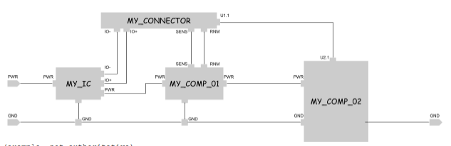

# PCB Netlist Visualizer + Validator

## Task
Build a small, proof-of-concept application which lets users:

- [x] Allow users to upload a simple [netlist](https://en.wikipedia.org/wiki/Netlist) file formatted as JSON
  - [x] Define a schema for the netlist json
    - [x] schema lists components w/pins
    - [x] schema lists nets
    - [x] schema specifies connections between nets and components
  - [x] setup upload endpoint and functionality
  - [x] test upload endpoint and functionality
  - [x] pivot to using the upload endpoint and therefore saving each submission

- [x] Allow users to visualize (SVG, Canvas, etc) the netlist as a graph where:
  - [x] Nodes are components (ICs, resistors, connectors, etc)
  - [x] Edges are electrical connections (nets)

- [x] Validate submitted netlist data conforms to a series of basic rules like:
  - [x] **Name** data must not be blank
  - [x] **GND** must be connected to all relevant components

- [x] Store submissions in a database (e.g. MongoDB)
  - [x] setup
  - [x] test
- [x] add users to support per-user requirements
  - [x] JWT auth
  - [x] users in mongodb
  - [x] admin and non-admin users
- [x] Display list of submissions per-user
- [x] Display validation results per-submission, highlighting violations

## Requirements

- [x] **Must use client ↔ server architecture**
- [x] **Must run locally to facilitate live development and review**
- [x] **Must be deployable + runnable in common cloud hosting services (e.g. AWS) using a docker container**

## Bugs
- [ ] no button to show password that i typed

## Extras
- [ ] make the graph visualization nicer
  - [ ] add footprints
  - [ ] add component symbols
---

*Note: This is an example prompt and is not authoritative.*
