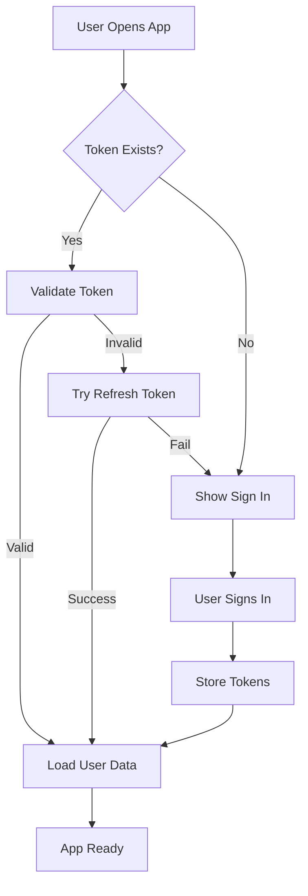

# NetWiz Frontend Authentication System

This document describes the complete authentication system implemented for the NetWiz frontend application.

## Overview

The authentication system provides:
- **Sign In/Sign Up**: User registration and authentication
- **Sign Out**: Secure session termination
- **Change Password**: Password management for authenticated users
- **Automatic Token Refresh**: Background token renewal to maintain sessions
- **Protected Routes**: Components that require authentication
- **User Profile Management**: Account information and settings

## Architecture

### Core Components

1. **AuthContext** (`/src/contexts/AuthContext.tsx`)
   - Central authentication state management
   - Provides authentication methods and state to the entire app
   - Handles token storage and retrieval from localStorage

2. **API Client** (`/src/services/api.ts`)
   - Enhanced with authentication endpoints
   - Automatic token attachment to requests
   - Automatic token refresh on 401 errors
   - Request queuing during token refresh

3. **Authentication Components** (`/src/components/auth/`)
   - `SignInForm`: User login interface
   - `SignUpForm`: User registration interface
   - `ChangePasswordForm`: Password change interface
   - `UserProfile`: User account management
   - `AuthModal`: Modal wrapper for auth forms
   - `ProtectedRoute`: Route protection component

4. **Token Refresh Hook** (`/src/hooks/useTokenRefresh.ts`)
   - Automatic background token refresh
   - Configurable refresh thresholds and intervals
   - JWT token expiration monitoring

### Authentication Flow



## API Integration

### Backend Endpoints

The system integrates with the following backend authentication endpoints:

- `POST /auth/signin` - User authentication
- `POST /auth/signup` - User registration
- `POST /auth/signout` - User logout
- `POST /auth/refresh` - Token refresh
- `POST /auth/change-password` - Password change
- `GET /auth/me` - Get current user info

### Request/Response Types

```typescript
// Sign In Request
interface UserLogin {
  username: string
  password: string
}

// Sign Up Request
interface UserCreate {
  username: string
  password: string
}

// Token Response
interface Token {
  access_token: string
  refresh_token: string
  token_type: string
  expires_in: number
  refresh_expires_in: number
}

// User Response
interface User {
  id: string
  username: string
  user_type: 'user' | 'admin'
  created_at: string
  is_active: boolean
}
```

## Usage Examples

### Basic Authentication

```tsx
import { useAuth } from '@/contexts/AuthContext'

function MyComponent() {
  const { isAuthenticated, user, signin, signout } = useAuth()

  const handleSignIn = async () => {
    try {
      await signin({ username: 'user', password: 'password' })
      console.log('Signed in successfully')
    } catch (error) {
      console.error('Sign in failed:', error)
    }
  }

  return (
    <div>
      {isAuthenticated ? (
        <div>
          <p>Welcome, {user?.username}!</p>
          <button onClick={signout}>Sign Out</button>
        </div>
      ) : (
        <button onClick={handleSignIn}>Sign In</button>
      )}
    </div>
  )
}
```

### Protected Routes

```tsx
import { ProtectedRoute } from '@/components/auth'

function App() {
  return (
    <Routes>
      <Route path="/public" element={<PublicPage />} />
      <Route
        path="/private"
        element={
          <ProtectedRoute>
            <PrivatePage />
          </ProtectedRoute>
        }
      />
    </Routes>
  )
}
```

### Automatic Token Refresh

```tsx
import { useTokenRefresh } from '@/hooks/useTokenRefresh'

function App() {
  // Automatically refresh tokens 5 minutes before expiry
  useTokenRefresh({
    refreshThresholdMinutes: 5,
    checkIntervalMinutes: 1
  })

  return <YourApp />
}
```

## Security Features

### Token Management
- **JWT Access Tokens**: Short-lived tokens for API requests
- **Refresh Tokens**: Long-lived tokens for token renewal
- **Automatic Refresh**: Background token renewal before expiration
- **Secure Storage**: Tokens stored in localStorage (consider httpOnly cookies for production)

### Request Security
- **Automatic Headers**: Authorization headers added to all requests
- **Token Refresh**: Automatic retry of failed requests after token refresh
- **Request Queuing**: Prevents multiple refresh attempts during token renewal

### Error Handling
- **401 Responses**: Automatic token refresh attempt
- **Refresh Failures**: Automatic logout and redirect to sign in
- **Network Errors**: Graceful degradation and user feedback

## Configuration

### Token Refresh Settings

```typescript
useTokenRefresh({
  refreshThresholdMinutes: 5,  // Refresh 5 minutes before expiry
  checkIntervalMinutes: 1       // Check every minute
})
```

### API Client Configuration

```typescript
// Default configuration in api.ts
const API_TIMEOUT = 30000 // 30 seconds
const DEFAULT_API_URL = 'http://localhost:5000'
```

## Demo Page

Visit `/auth-demo` to see the authentication system in action. The demo page includes:

- Authentication status display
- Sign in/up forms
- Protected content demonstration
- User profile management
- Password change functionality

## Development Notes

### Adding New Protected Endpoints

1. Add the endpoint to the API client
2. The authentication headers are automatically added
3. Token refresh is handled automatically

### Customizing Authentication UI

All authentication components are fully customizable:
- Modify component styles in `/src/components/auth/`
- Update form validation rules
- Customize error messages and user feedback

### Testing Authentication

1. Start the backend server
2. Navigate to `/auth-demo`
3. Try signing up with a new account
4. Test sign in/out functionality
5. Verify protected content access
6. Test password change feature

## Future Enhancements

- **Two-Factor Authentication**: Add 2FA support
- **Social Login**: Integration with OAuth providers
- **Session Management**: Multiple device session tracking
- **Password Reset**: Forgot password functionality
- **Account Verification**: Email verification for new accounts
- **Role-Based Access**: Fine-grained permissions system
